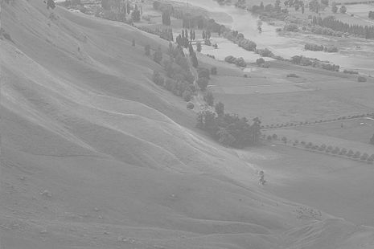
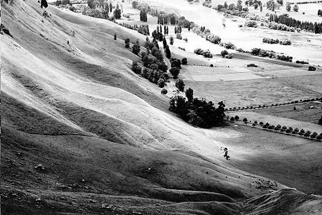

# Reti Logiche final project

Images equalizer final project of **Reti Logiche** course held
at Politecnico di Milano. (2020/2021)  

**Teacher** Fabio Salice

 

## Authors
* [Lorenzo Iovine](https://github.com/lorenzoiovine99)
* [Nicola Landini](https://github.com/neekoo0)

# Tools
* Vivado - IDE
